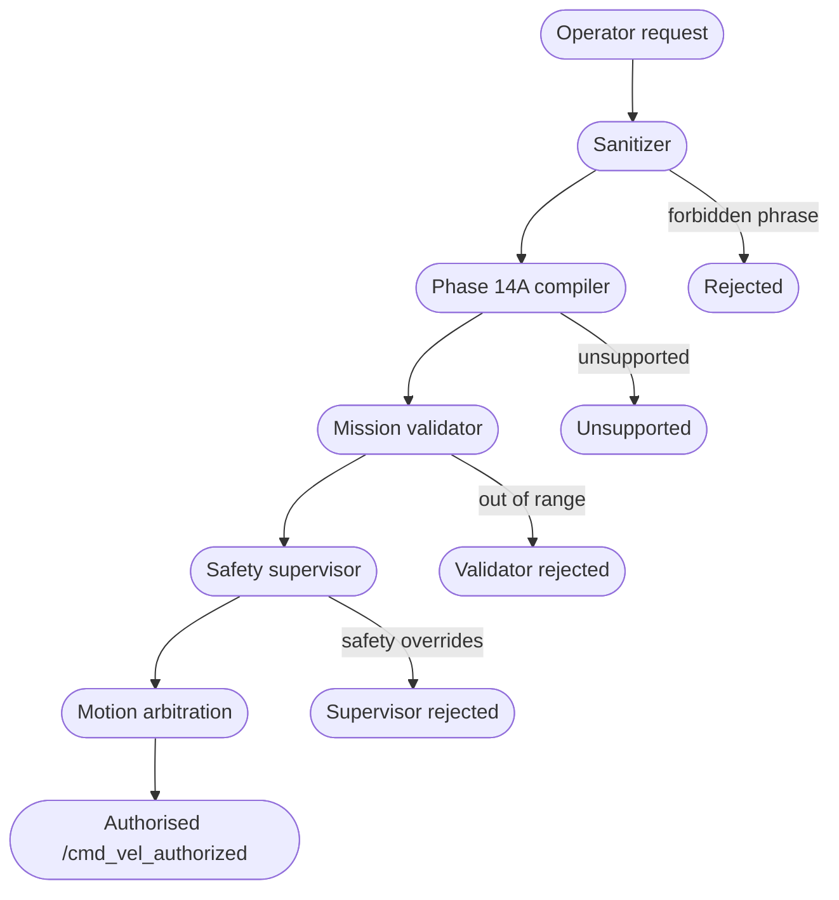

# Safety Authority Visualization (Phase 17A)

The platform is **not safety-certified.** The Phase 17A safety
authority page at `apps/mission-control/src/app/safety/page.tsx`
exists for a single reason: to make the authority chain visible at
a glance so an operator or reviewer cannot mistake the simulation
layer for a real-robot control surface.

## 1. Authority chain (Mermaid)

The diagram is rendered client-side via `MermaidView`; the
server-side fallback is the raw source so the page works without
JavaScript.

## 2. Authority rules

| Rule                                                                 | Backed by                              |
|----------------------------------------------------------------------|----------------------------------------|
| Only the safety supervisor authorises motion                         | REQ-SAFE-001, REQ-MISSION-001          |
| Validator-rejected plans never reach the supervisor                  | REQ-REHEARSAL-003                      |
| Sanitizer rejection skips the compiler                               | REQ-PROPOSAL-003, REQ-SKILL-LLM-003    |
| Local LLM providers are disabled by default                          | REQ-SKILL-LLM-001                      |
| Bag-backed evidence requires real bag artifacts                      | REQ-LIVE-001..005, REQ-REHEARSAL-004   |
| Mission-control UI does not open a network socket                    | REQ-MCTRL-001, REQ-MCTRL-010           |

## 3. Hard boundaries

The Safety Authority page lists, verbatim, what the platform cannot
do:

* Move a real robot.
* Publish to `/cmd_vel` directly.
* Open a network socket from the mission-control UI.
* Call cloud LLM APIs.
* Execute generated code.
* Claim safety certification.
* Mark a simulated rehearsal as bag-backed.

These rules are enforced by:

* the deterministic backend (Phase 14B / 15A / 15B / 16
  sanitizers and validators);
* the Phase 16 mission rehearsal state machine;
* the Phase 17A frontend honesty tests at
  `apps/mission-control/tests/honesty.test.ts`.

## 4. Operator-visible boundary

The `SafetyBoundaryBanner` sits at the top of every Phase 17A
surface. Its text is unambiguous: *"Simulation-only platform. Not
safety-certified. The runtime safety supervisor and motion
arbitration remain authoritative for any real robot motion."*

The sidebar's honesty footer repeats: *"Simulation-only. Not
safety-certified. Bag-backed evidence count remains 0."*

## 5. Future direction

A follow-up phase that wires Phase 16 rehearsals into a real
Gazebo runner (per
`docs/DEFERRED_PHASES.md#digital-twin-direction`) must:

1. update this page to reflect the new authority handoff;
2. extend `REQ-MCTRL-005` so the dashboard correctly distinguishes
   bag-backed evidence from simulated rehearsals;
3. add an ADR documenting the new boundary;
4. add a test that asserts the new boundary cannot be silently
   bypassed.
