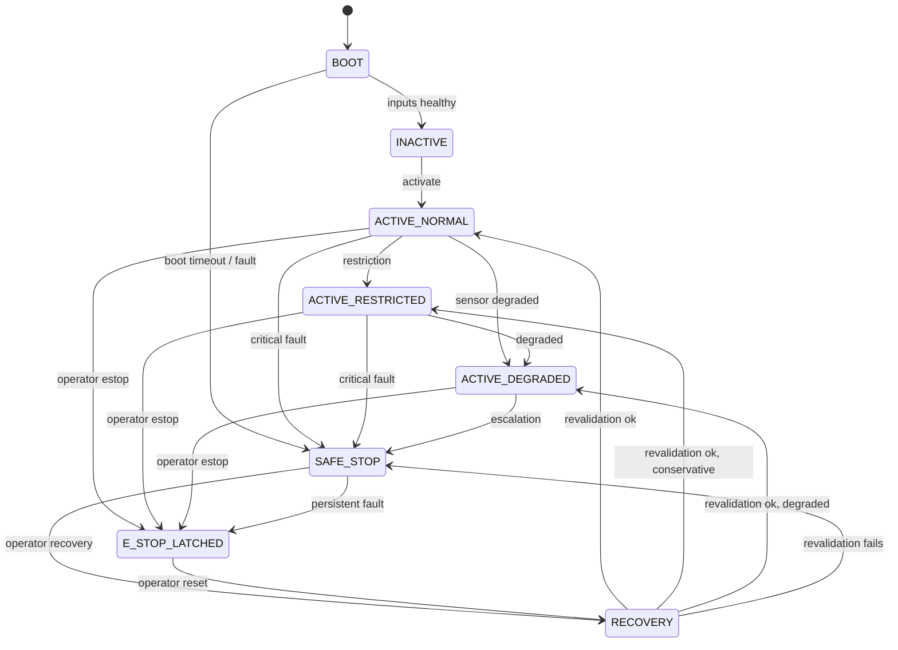

# Safety Model

## 1. Purpose

This document defines the safety authority model and the safety state machine for the Autonomous Safety Validation Rover Platform.

The safety model is the controlling document for any subsystem that produces, transports, arbitrates, or executes motion. It defines who is allowed to authorize motion, who is not, what states the platform can occupy, and how transitions between those states are made and recorded.

The model is binding on simulation and hardware alike. The rover is architecturally incapable of bypassing the safety supervisor by design, not by accident.

This model is engineered for inspectability and replay. It does not claim certification under ISO 13849, ISO 26262, IEC 61508, or any other functional safety standard. It is informed by the architectural discipline found in those domains, but it does not assert compliance with any of them.

---

## 2. Safety Authority Hierarchy

The safety authority hierarchy is strictly ordered.

| Level | Authority | Owner |
|---|---|---|
| 1 | Final motion authorization | Safety supervisor |
| 2 | Motion request (not authorization) | Mission / planner / behavior tree |
| 3 | Sensor health assessment, freshness, disagreement | Confidence subsystem and sensor adapters |
| 4 | Actuator command execution | Hardware gateway |
| 5 | Operator overrides (E-stop, reset) | Operator pathway, latched in supervisor |

Higher-level authority can never be overridden by lower-level authority. The mission layer cannot override the safety supervisor, and the planner cannot bypass arbitration to write actuator commands directly.

The hardware gateway is the only subsystem permitted to write to the actuator interface. It must reject any command that does not originate from the supervisor's authorized command topic.

---

## 3. Motion Authorization Rules

The platform exposes two distinct command channels:

- `/cmd_vel_requested` — produced by the mission layer and planner, treated as a request
- `/cmd_vel_authorized` — produced by the safety supervisor, treated as an authorization

The hardware gateway subscribes only to `/cmd_vel_authorized`. It must never subscribe to `/cmd_vel_requested`. This separation is the architectural enforcement of motion authority.

Authorization rules:

1. The safety supervisor must be in an `ACTIVE_*` state to authorize non-zero motion.
2. In `SAFE_STOP` and `E_STOP_LATCHED`, `/cmd_vel_authorized` must be a constant zero command at the configured rate.
3. The supervisor must clamp every authorized command to the velocity, angular velocity, and acceleration limits defined for the current state.
4. The supervisor must not republish a request that violates the ODD or freshness gates. It must clamp, drop, or reduce, and emit a `motion_arbitration` event explaining the action.
5. `/cmd_vel_authorized` must be published at a configured rate even when the value is zero. A silent supervisor is a fault, not a default.

---

## 4. Subsystem Restrictions

### 4.1 Safety supervisor responsibilities

The safety supervisor must:

- own the safety state machine
- evaluate ODD compliance every cycle
- monitor freshness of every required input
- monitor watchdogs registered against it
- arbitrate between `/cmd_vel_requested` and the active state's limits
- publish `/cmd_vel_authorized` at the configured rate
- publish `/safety/state` when the state changes
- emit a structured event for every state transition and every clamp or drop action
- refuse activation if any required input is missing, stale, or inconsistent

The supervisor must not:

- run mission logic
- run planner logic
- own SLAM, perception, or world-model logic
- write directly to actuator interfaces

### 4.2 Mission layer restrictions

The mission layer (BehaviorTree.CPP and any waypoint or recovery orchestration) may:

- request motion via `/cmd_vel_requested`
- request lifecycle transitions through service calls
- request scenario or mission completion through structured events

The mission layer may not:

- write to `/cmd_vel_authorized`
- write directly to actuator interfaces
- mutate `/safety/state`
- override clamps applied by the supervisor
- bypass arbitration via private topics or services

### 4.3 Hardware gateway restrictions

The hardware gateway (simulated or physical) must:

- subscribe only to `/cmd_vel_authorized`
- enforce a command timeout independent of the supervisor's timeout
- decay to zero motion if `/cmd_vel_authorized` is silent past the timeout
- emit a structured `motion_arbitration` event when it decays to zero due to timeout
- not buffer commands across a transport disconnect

The hardware gateway may not:

- subscribe to `/cmd_vel_requested`
- accept commands over any other channel
- be combined with the supervisor or mission process when this would violate the authority hierarchy

---

## 5. State Machine

### 5.1 States

```text
BOOT
INACTIVE
ACTIVE_NORMAL
ACTIVE_RESTRICTED
ACTIVE_DEGRADED
SAFE_STOP
E_STOP_LATCHED
RECOVERY
```

### 5.2 State Definitions

#### BOOT
Initial state on supervisor startup. Required inputs are being discovered and validated. Motion is prohibited. `/cmd_vel_authorized` publishes zero at the configured rate.

#### INACTIVE
Supervisor is healthy, all required inputs are valid, but no operator or mission activation has been received. Motion is prohibited. `/cmd_vel_authorized` publishes zero.

#### ACTIVE_NORMAL
Nominal operation. All inputs healthy and within ODD. The supervisor authorizes motion subject to the `ACTIVE_NORMAL` limits.

#### ACTIVE_RESTRICTED
Operational envelope reduced. Examples: reduced velocity, restricted navigation regions, lower acceleration. Used when the system is healthy but a scenario or operator constraint requires conservatism.

#### ACTIVE_DEGRADED
At least one non-critical sensing pathway is invalidated, or sensor disagreement is above tolerance, but minimum safe mobility is still achievable under the degraded limits. Used to make degraded behavior bounded and explainable.

#### SAFE_STOP
Minimum-risk halt. `/cmd_vel_authorized` is zero. The supervisor remains active and continues to evaluate inputs. May self-recover only through `RECOVERY`.

#### E_STOP_LATCHED
Operator-asserted or escalated emergency stop. `/cmd_vel_authorized` is zero. The supervisor may not self-clear this state. Requires an explicit operator reset event.

#### RECOVERY
Controlled revalidation phase. The supervisor inspects all required inputs and the offending condition, and emits a `safety_transition` event when revalidation succeeds. Only then does the supervisor transition to an `ACTIVE_*` state, which may be more restrictive than the originally interrupted state.

### 5.3 Transition Rules

| From | To | Trigger |
|---|---|---|
| `BOOT` | `INACTIVE` | All required inputs present and valid |
| `BOOT` | `SAFE_STOP` | Required input invalid past the boot timeout |
| `INACTIVE` | `ACTIVE_NORMAL` | Operator or mission activation, all gates healthy |
| `ACTIVE_NORMAL` | `ACTIVE_RESTRICTED` | Configured restriction asserted (scenario, operator, ODD condition) |
| `ACTIVE_NORMAL` | `ACTIVE_DEGRADED` | Non-critical sensor failure, sensor disagreement, or bounded ODD exit |
| `ACTIVE_NORMAL` | `SAFE_STOP` | Critical input fault, watchdog, or hard ODD exit |
| `ACTIVE_RESTRICTED` | `ACTIVE_DEGRADED` | Sensor degradation while restriction holds |
| `ACTIVE_RESTRICTED` | `SAFE_STOP` | Critical input fault or operator request |
| `ACTIVE_DEGRADED` | `SAFE_STOP` | Additional fault or persistent degradation |
| Any `ACTIVE_*` | `E_STOP_LATCHED` | Operator E-stop or escalated critical fault |
| `SAFE_STOP` | `E_STOP_LATCHED` | Operator E-stop or persistent unrecoverable fault |
| `SAFE_STOP` | `RECOVERY` | Operator-issued recovery request, condition believed cleared |
| `RECOVERY` | `ACTIVE_NORMAL` or `ACTIVE_RESTRICTED` or `ACTIVE_DEGRADED` | Revalidation succeeds |
| `RECOVERY` | `SAFE_STOP` | Revalidation fails |
| `E_STOP_LATCHED` | `RECOVERY` | Operator-issued explicit reset event |

The transition graph is intentionally one-directional toward higher restriction. There is no path from `SAFE_STOP` directly to `ACTIVE_*` without `RECOVERY`. There is no path from `E_STOP_LATCHED` to anywhere except `RECOVERY` after a deliberate operator reset.

### 5.4 State Diagram



---

## 6. Watchdog Model

The supervisor owns a registry of watchdogs. Each watchdog has:

- a name
- a configured deadline
- a configured action (transition to `ACTIVE_DEGRADED`, `SAFE_STOP`, or `E_STOP_LATCHED`)
- a configured event reason code

Watchdogs are petted by their owning subsystem at a configured rate. A watchdog that is not petted within its deadline expires.

Required watchdogs at MVP:

- LiDAR freshness watchdog
- IMU freshness watchdog
- Encoder freshness watchdog
- Authorized command consumer watchdog (gateway must heartbeat to supervisor)
- TF freshness watchdog
- Mission heartbeat watchdog (warning only at MVP)

Watchdog expirations must produce a `watchdog` event and must trigger the configured state transition. The supervisor may not silently re-arm a watchdog without a state transition.

---

## 7. Freshness Monitoring

For every required input, the supervisor maintains:

- the configured maximum permissible age
- the most recent observed timestamp
- a freshness flag

Freshness violations produce a `sensor_health` event and trigger a degraded or safe-stop transition per the configured policy. The threshold for transitioning to `SAFE_STOP` must be more aggressive than the threshold for transitioning to `ACTIVE_DEGRADED`.

Freshness is computed against the supervisor's clock. Where the simulator publishes `/clock`, the supervisor must use simulated time for freshness checks; mixing wall time and sim time is prohibited.

---

## 8. Degraded-Mode Semantics

`ACTIVE_DEGRADED` is a bounded operational state, not a soft fallback.

In `ACTIVE_DEGRADED`:

- the system continues to operate within reduced limits
- the supervisor must continue to authorize motion, clamped to degraded limits
- the supervisor must not silently return to `ACTIVE_NORMAL`; it must transit through `RECOVERY`
- every cycle must emit a `safety_state` event of severity at least `WARNING` until the degradation clears
- mission planning may be informed of the degradation but must not bypass it

The intent of degraded mode is to preserve a controlled, explainable, replayable behavior in the face of partial faults, not to mask them.

---

## 9. Safe-Stop Semantics

`SAFE_STOP`:

- is entered when a critical input fails, a watchdog expires, an ODD violation is detected, or a hard fault is reported
- forces `/cmd_vel_authorized` to zero linear and zero angular velocity
- continues to publish authorized commands at the configured rate, with zero values
- continues to evaluate the system; the supervisor remains alive
- can only exit toward `RECOVERY` on operator request, or toward `E_STOP_LATCHED` on escalation

`SAFE_STOP` is not a passive state. It is an active assertion of zero motion authority.

---

## 10. E-Stop Latch Semantics

`E_STOP_LATCHED`:

- is entered by operator action or by escalation from a persistent fault
- is latched. The supervisor may not auto-clear it.
- exits only on an explicit operator reset event into `RECOVERY`
- forces `/cmd_vel_authorized` to zero at all times

The operator reset must be a distinct, intentional action, not a side effect of other operations. The reset event must be logged with operator identity (or operator pathway identity) in the event stream.

---

## 11. Recovery Semantics

`RECOVERY`:

- revalidates every required input listed in `docs/ODD.md` section 5
- revalidates that the triggering condition has cleared
- emits a `safety_transition` event on success or failure
- transitions to an `ACTIVE_*` state on success, never directly to `ACTIVE_NORMAL` without satisfying that state's gates
- transitions back to `SAFE_STOP` on failure

Recovery must not be triggered automatically by mission logic. Recovery is operator-authorized, scenario-authorized, or supervisor-internal after a configured cool-down.

---

## 12. Failure Escalation Examples

### 12.1 Stale LiDAR

1. LiDAR freshness watchdog expires.
2. Supervisor emits a `sensor_health` event with reason `stale_lidar`.
3. Supervisor transitions to `ACTIVE_DEGRADED` and emits a `safety_transition` event.
4. If staleness persists past the safe-stop threshold, supervisor transitions to `SAFE_STOP` and emits another `safety_transition`.
5. `/cmd_vel_authorized` is forced to zero on entering `SAFE_STOP`.

### 12.2 Authorized Command Consumer Silence

1. Hardware gateway stops heartbeating to the supervisor.
2. Gateway watchdog expires.
3. Supervisor emits a `watchdog` event with reason `gateway_silent`.
4. Supervisor transitions to `SAFE_STOP`.
5. Hardware gateway, observing its own command timeout, also decays to zero independently.

### 12.3 Operator E-Stop

1. Operator asserts E-stop through the configured pathway.
2. Supervisor latches `E_STOP_LATCHED`.
3. `/cmd_vel_authorized` becomes zero at all times.
4. No automatic recovery is permitted.

### 12.4 Sensor Disagreement

1. Confidence subsystem detects IMU vs encoder disagreement above tolerance.
2. Supervisor emits a `sensor_health` event with reason `sensor_disagreement`.
3. Supervisor transitions to `ACTIVE_DEGRADED`.
4. If disagreement persists or worsens, supervisor escalates to `SAFE_STOP`.

---

## 13. Anti-Bypass Rules

The following are prohibited by design:

1. Subscribing to `/cmd_vel_authorized` from any subsystem other than the hardware gateway.
2. Publishing to `/cmd_vel_authorized` from any subsystem other than the safety supervisor.
3. Subscribing to `/cmd_vel_requested` from the hardware gateway.
4. Setting `/safety/state` from any subsystem other than the safety supervisor.
5. Disabling the supervisor at runtime through a non-operator pathway.
6. Combining mission and supervisor logic into a single executable when this allows direct actuator writes.
7. Using fault injection to set safety state directly. Fault injection alters inputs or timing only.
8. Bypassing watchdogs or freshness checks through configuration overrides without an explicit ADR.

Violations of these rules are architectural defects and must be treated as blocking issues, not warnings.

---

## 14. Anti-Bypass Enforcement

Where possible, anti-bypass rules are enforced architecturally:

- topic naming makes the requested-vs-authorized distinction explicit
- the gateway implementation explicitly documents its only allowed subscription
- contract tests assert that prohibited subscriptions and publications are not made
- replay tooling flags any run in which `/cmd_vel_authorized` is published by an unexpected node

Where they cannot be enforced architecturally, they must be enforced by tests and code review. They must never be enforced by trust alone.
