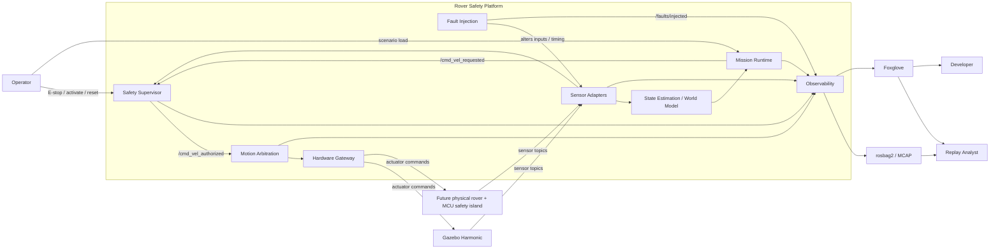

# System Context

## 1. System Purpose

The Autonomous Safety Validation Rover Platform exists to validate deterministic autonomous rover behavior under degraded operational conditions, simulation-first.

Its primary value is not its rover, its simulator, or its mission logic. Its primary value is the architectural discipline that makes failures bounded, explainable, and replayable.

This document establishes the system context: who and what interacts with the platform, where the trust boundaries are, and how data flows across them. It is the system's "outside view" and is intended to make the platform's external surface unambiguous.

---

## 2. Primary Actors

| Actor | Description |
|---|---|
| Operator | A human responsible for activating, monitoring, and stopping the rover during a run. The operator can assert E-stop, request recovery, and load scenarios. |
| Developer | An engineer writing or modifying platform code, scenarios, or simulator worlds. Develops on a workstation; rarely interacts with a live rover except in operator-presence mode. |
| Simulation Runtime | A running Gazebo Harmonic instance providing physics, sensor models, and world state during simulation runs. |
| Safety Supervisor | The runtime subsystem that owns the safety state machine and authorizes motion. Treated as a primary actor because the rest of the system is structured around its authority. |
| Mission Runtime | The runtime subsystem that requests motion, sequences waypoints, and orchestrates recovery behaviors via behavior trees. |
| Hardware Gateway | The runtime subsystem that consumes authorized commands and writes them to the actuator interface, simulated or physical. |
| Telemetry Consumer | A live or post-run consumer of recorded data and event streams (e.g., Foxglove, replay tooling, dashboards). |
| Replay Analyst | A reviewer reconstructing an incident from a recorded run, typically using `runs/<run_id>/` artifacts. |

---

## 3. External Systems

| External System | Role |
|---|---|
| Gazebo Harmonic | Primary simulator. Provides the physical model of the rover and the world during simulation runs. |
| ROS 2 graph | Middleware. Carries topics, services, and actions across nodes. Implemented over DDS. |
| Foxglove | Visualization and review surface. Displays bag and live data; consumes saved layouts. |
| rosbag2 / MCAP | Recording substrate for ROS 2 topic data. |
| Future physical rover | Bench hardware target for Phase 5 onward. Treated as future-tense in this document; it is not part of the MVP. |
| Future MCU safety island | Dedicated MCU that handles timing-sensitive safety and actuator control. Part of the hardware split introduced in Phase 5 onward. |

---

## 4. Runtime Environments

The platform runs in three distinct environments:

| Environment | Description | When Used |
|---|---|---|
| Simulation host | A workstation or CI node running Ubuntu 24.04 with ROS 2 Jazzy and Gazebo Harmonic. The full ROS 2 graph runs on this host alongside the simulator. | Phase 1 onward. Primary development and validation environment. |
| Bench hardware | A bench setup with a Raspberry Pi 5 class SBC running ROS 2 Jazzy, plus a dedicated MCU running the safety-critical actuator and watchdog firmware. | Phase 5 onward. |
| Replay workstation | A developer workstation with the bag, event stream, and Foxglove. No simulator and no rover required. | Any phase, post-run. |

---

## 5. Trust Boundaries

The system has explicit trust boundaries. Crossing a boundary requires either an enforced contract (topic, service, action) or an operator-authorized action.

### 5.1 Simulation boundary

Between the simulator and the ROS 2 graph.

- The simulator publishes sensor data and consumes actuator commands through `ros_gz_bridge`.
- ROS 2 nodes never depend on simulator-internal state; they depend only on the topic contract.
- Fault injection that targets the bridge is allowed (`bridge.gz_to_ros`, `bridge.ros_to_gz`); fault injection that mutates simulator-internal state without a topic-level effect is prohibited.

### 5.2 Hardware boundary

Between the SBC's ROS 2 graph and the MCU safety island (future, Phase 5+).

- The SBC sends authorized commands and receives sensor data through a narrow protocol (micro-ROS or equivalent).
- The MCU enforces command timeout and actuator decay-to-zero independently of the SBC.
- The SBC is not assumed to be hard real-time; the MCU is the timing-sensitive endpoint.

### 5.3 Operator boundary

Between the operator and the platform.

- E-stop is asserted through a dedicated topic published by an operator pathway. The pathway is identified in the event attributes (e.g., `physical_button`, `dashboard_button`).
- Recovery is operator-authorized; the supervisor never auto-clears `E_STOP_LATCHED`.
- Activation is operator-authorized; the supervisor refuses to enter `ACTIVE_NORMAL` without an operator action and healthy gates.
- Operator inputs are logged with operator-pathway identity in the event stream.

### 5.4 Telemetry boundary

Between the platform and consumers of telemetry (Foxglove, dashboards, replay tooling).

- Telemetry is read-only with respect to the rover. No safety decision is contingent on a telemetry consumer being alive.
- Loss of a telemetry consumer must not change motion authorization.
- Telemetry consumers should never publish to `/cmd_vel_authorized`, `/safety/state`, or `/cmd_vel_requested`.

### 5.5 Mission boundary

Between mission orchestration and arbitration.

- Mission outputs are requests on `/cmd_vel_requested`. They are not authorizations.
- The mission layer cannot mutate `/safety/state` or `/cmd_vel_authorized`.
- Mission lifecycle transitions are events, not control inputs to the safety supervisor.

### 5.6 Fault injection boundary

Between fault injection and the rest of the system.

- Fault injection alters inputs and timing only.
- Fault injection cannot set `/safety/state` or write `/cmd_vel_authorized`.
- Fault injection emits structured events for every lifecycle change.

---

## 6. Data Flow Summary

### 6.1 Sensor data flow

```text
Simulator/Hardware --> Sensor Adapters --> State Estimation / World Model --> Mission Layer
                                       \--> Safety Supervisor (freshness/disagreement gates)
```

Sensor adapters publish normalized topics. The state estimator and world model consume them. The safety supervisor independently consumes them for freshness and disagreement evaluation. The mission layer reads the world model, not raw sensors.

### 6.2 Motion authorization flow

```text
Mission Layer --> /cmd_vel_requested --> Safety Supervisor --> /cmd_vel_authorized --> Hardware Gateway --> Simulator/Hardware
```

Only the supervisor publishes `/cmd_vel_authorized`. Only the gateway subscribes to it.

### 6.3 Event flow

```text
All subsystems --> structured events --> /safety/events (and events.jsonl on disk)
                                  \--> Foxglove and replay tooling
```

All operationally significant facts are emitted as events. The event stream is recorded to disk and published on a topic for live consumption.

### 6.4 Fault injection flow

```text
Scenario file --> Fault Injection Subsystem --> Targeted topics or watchdog owners
                                          \--> /faults/injected
                                          \--> structured events (fault_injection.*)
```

Fault injection is fully observable through `/faults/injected` and through events.

### 6.5 Replay flow

```text
Recorded run --> events.jsonl + bags/ + traces/ + foxglove-layout.json --> Replay Analyst
```

Replay is read-only. It does not influence live operation.

---

## 7. System Context Diagram



The diagram shows that the safety supervisor sits between mission requests and authorized commands, and that fault injection alters inputs to peers rather than controlling safety state.

---

## 8. What the Platform is Not Responsible For

The platform context explicitly excludes:

- public road or sidewalk operation
- any safety certification artifact
- any guarantee of bit-exact physics across simulator versions
- cloud-side telemetry storage or analytics
- multi-rover coordination
- continuous learning at runtime
- camera-first perception (until and unless gated by an ADR)

These exclusions are not aspirational. They define the surface the platform is willing to be evaluated against.

---

## 8a. ROS 2 / Gazebo Layer (Phase 1B)

The system context above is unchanged by Phase 1B; the ROS 2 graph and
the Gazebo simulator are infrastructure layers that realise the same
boundaries.

* The **simulation boundary** is materialised by `ros_gz_bridge`. The
  YAML config in `rover_ws/src/rover_sim_gazebo/config/ros_gz_bridge.yaml`
  is the binding artefact: only `/cmd_vel_authorized` is forwarded
  ROS_TO_GZ on a motion topic. Everything else is GZ_TO_ROS.
* The **mission boundary** is materialised by topic naming.
  Mission/teleop/Nav2 producers publish to `/cmd_vel_requested`. The
  safety bridge is the only subscriber to that topic (besides
  observers); the only producer of `/cmd_vel_authorized`; and embeds
  the deterministic supervisor verbatim.
* The **operator boundary** is materialised by four `std_msgs/Bool`
  topics: `/operator/activate`, `/operator/estop`, `/operator/recovery`,
  `/operator/reset`. Asserting `/operator/estop` immediately latches
  `E_STOP_LATCHED`; recovery requires `/operator/reset` followed by
  successful revalidation.
* The **telemetry boundary** is materialised by the observability
  package: `rover_run_manager` allocates the run directory,
  `rover_event_recorder` persists `/safety/events` JSON to
  `events.jsonl`, and `ros2 bag record` produces the MCAP bag under
  `runs/<run_id>/bags/`.

This section is informative. The binding contracts remain in
`docs/SAFETY_MODEL.md`, `docs/EVENT_MODEL.md`, and
`docs/REPLAY_SYSTEM.md`.

---

## 9. Context Change Control

Changes to the system context require:

- updating this document
- updating affected trust boundaries explicitly
- an ADR if the change introduces a new external system, a new actor, or a new trust boundary
- updates to `docs/ODD.md` and `docs/SAFETY_MODEL.md` where they are affected
