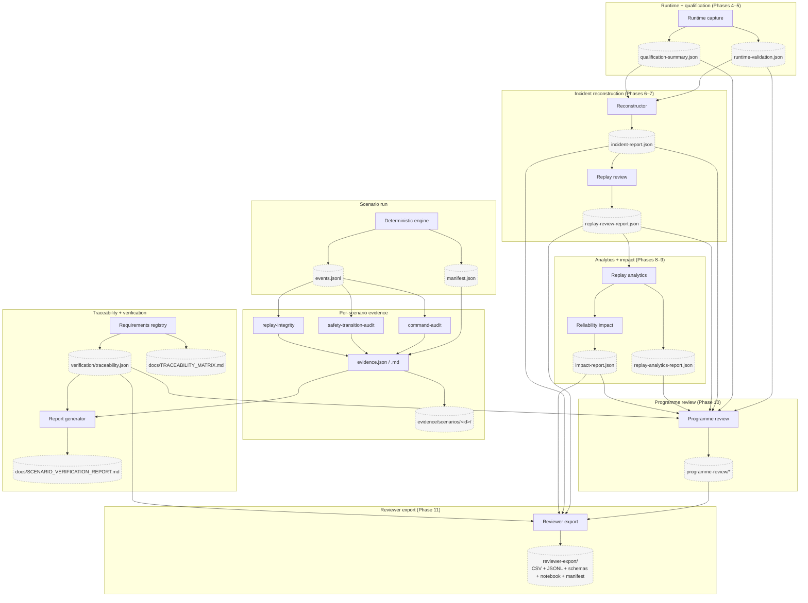

# Evidence Flow

The platform is **not safety-certified**. This diagram shows how
engineering evidence flows from a single scenario run all the way
out to the reviewer-export bundle.

## Honesty rules visible in this flow

- **Every layer is read-only with respect to the layer below it.**
  Programme review never mutates incidents; reviewer export never
  mutates programme review.
- **`static_only` and `missing_bag` flags propagate verbatim**
  from the runtime layer all the way to
  `reviewer-export/csv/replay_quality.csv`.
- **Aggregations refuse to claim causality.** Programme review and
  reliability impact use correlation language; the reviewer export
  pins `causality_claimed` to `const: false` at schema level.
- **Missing inputs are reported, not synthesised.** Loaders emit
  structured warnings; reports use `insufficient_history` /
  `unknown` / `not_started`.

## Related documents

- [`docs/EVENT_MODEL.md`](../EVENT_MODEL.md)
- [`docs/REPLAY_SYSTEM.md`](../REPLAY_SYSTEM.md)
- [`docs/VERIFICATION_STRATEGY.md`](../VERIFICATION_STRATEGY.md)
- [`docs/PROGRAMME_REVIEW.md`](../PROGRAMME_REVIEW.md)
- [`docs/REVIEWER_EXPORTS.md`](../REVIEWER_EXPORTS.md)
- [`docs/diagrams/replay-flow.md`](replay-flow.md)
