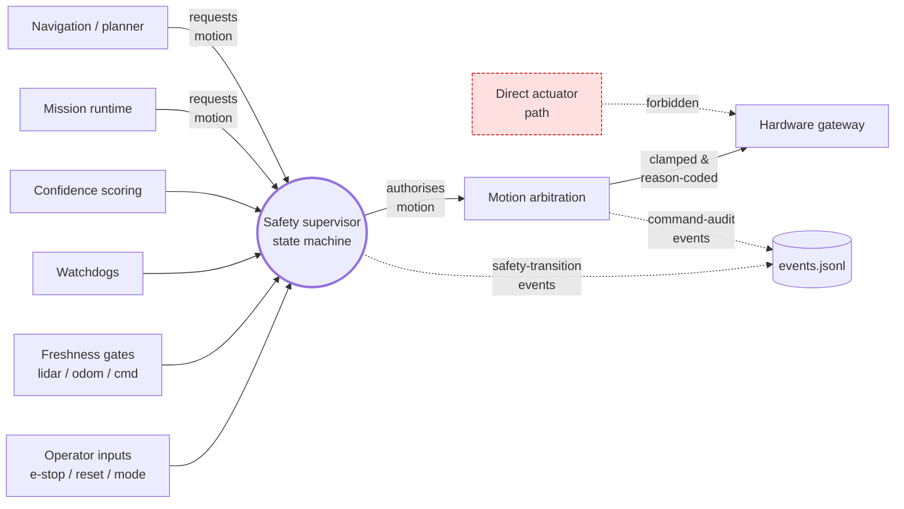

# Safety Authority

The platform is **not safety-certified**. This diagram shows the
single-authority motion-command path that every actuator command in
the system must pass through.

## Authority rules

1. **Only the supervisor authorises motion.** Mission, navigation,
   perception, and operator code may *request* motion. They cannot
   command the gateway directly.
2. **State-machine guards every authorisation.** Safety states are
   `ACTIVE_NORMAL`, `ACTIVE_DEGRADED`, `RESTRICTED`, `SAFE_STOP`,
   `E_STOP_LATCHED`, `RECOVERY`. Each transition is allowed-list
   checked and reason-coded.
3. **E-stop is latched.** Leaving `E_STOP_LATCHED` requires an
   explicit operator-acknowledged reset; nothing else can clear it.
4. **`SAFE_STOP` zeroes commands.** Authorised commands in
   `SAFE_STOP` are zero, period.
5. **`RESTRICTED` clamps velocity.** Authorised commands honour the
   restricted envelope, irrespective of what the requester asked
   for.
6. **Faults change inputs, not state.** Fault injection mutates
   sensor readings, command timeouts, bridge connectivity, or
   watchdog pets — never the state machine.

## How the rules are proven

| Rule | Proven by |
| --- | --- |
| Single authoriser | `tools/audit_command_path.py` (every authorised command has a paired prior request) |
| Allowed-list transitions | `tools/audit_safety_transitions.py` |
| `SAFE_STOP` zeroing | scenario `safe_stop_during_active_mission`, supervisor unit tests |
| E-stop latching | scenario `estop_latched_manual_reset_required` |
| `RESTRICTED` clamping | scenario `stale_lidar_restricted_mode` |
| Faults do not mutate state | absence of `SafetyState` writes in `backend/app/faults/`; supervisor unit tests under fault inputs |

## Related documents

- [`docs/SAFETY_MODEL.md`](../SAFETY_MODEL.md)
- [`docs/EVENT_MODEL.md`](../EVENT_MODEL.md)
- [`docs/FAULT_INJECTION.md`](../FAULT_INJECTION.md)
- [`ARCHITECTURE.md`](../../ARCHITECTURE.md)
- [`docs/diagrams/system-flow.md`](system-flow.md)
