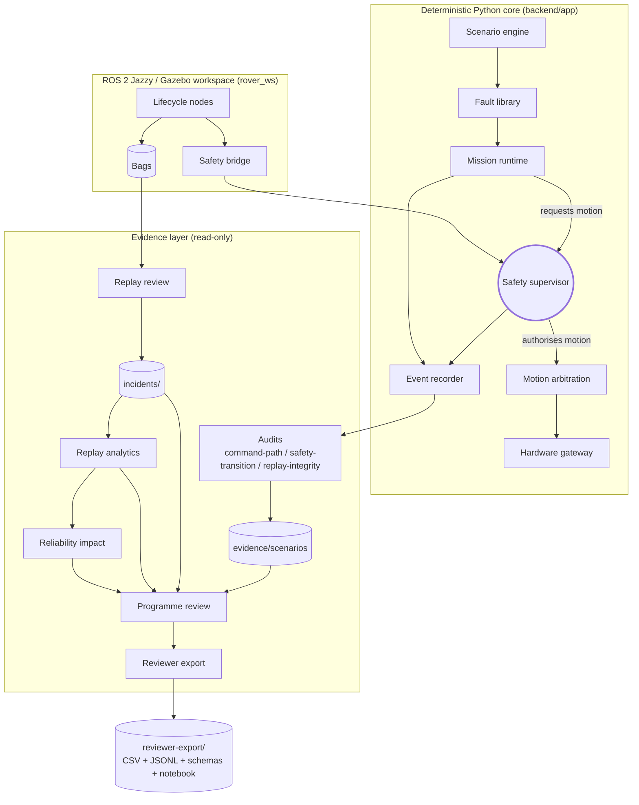

# System Flow

The platform is **not safety-certified**. This diagram shows how
the deterministic Python core, the ROS 2 / Gazebo workspace, and
the evidence layers fit together.

## Notes

- Only the **safety supervisor** can authorise motion. Mission code
  may request; nothing else may authorise.
- Faults change inputs (sensor readings, command timeouts, bridge
  state, watchdog pets); the supervisor reacts through normal
  mechanisms.
- The ROS 2 side honours the same contracts as the Python core.
  When no Jazzy host is available, the runtime layers fall back to
  `static-only` and label the result honestly.
- The whole evidence layer is **read-only** with respect to runtime
  state: it inspects, classifies, aggregates, and reports — nothing
  more.

See [`ARCHITECTURE_WALKTHROUGH.md`](../ARCHITECTURE_WALKTHROUGH.md)
for the module-by-module narrative.
