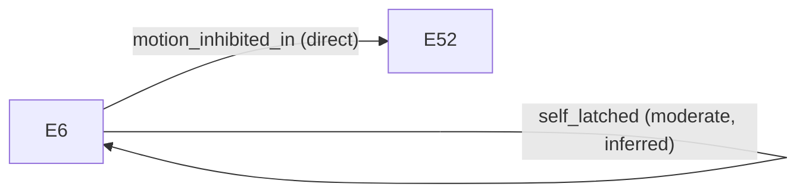

# Causality — `canonical-estop-latched`

## `operator_estop_chain` — `moderate`

operator_estop -> estop_latched -> motion_inhibited

**Missing links:**
- operator E-stop event

This report is an engineering analysis artifact generated from available simulation and runtime evidence. It does not represent safety certification or regulatory approval.
