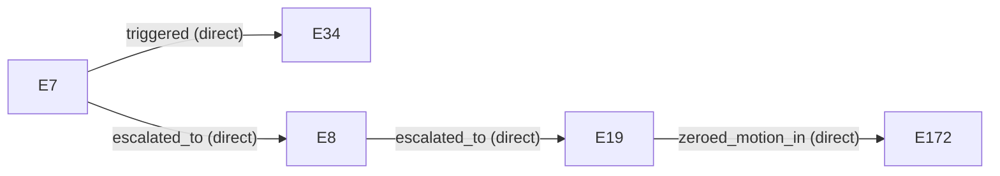

# Causality — `canonical-stale-lidar`

## `stale_lidar_chain` — `direct`

stale_lidar -> freshness_violation -> degraded/restricted -> safe_stop -> zero_authorized_motion

This report is an engineering analysis artifact generated from available simulation and runtime evidence. It does not represent safety certification or regulatory approval.
